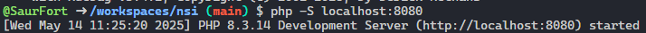

# The Boy of Worlds: Tegia

The Boy of Worlds: Tegia est un jeu basé sur l'univers de The Boy of Worlds. Il reprend l'histoire de Tegia (M7) et plus spécifiquement de la fin de la guerre entre les Kraiths et les Yalks.

Ce projet rentre dans le cadre d'un projet de spécialité NSINF, pour voir les contraintes posé par ce projet, vous pouvez consulter la section [Contrainte Technique](#contrainte-technique).

## Sommaire

- [The Boy of Worlds: Tegia](#the-boy-of-worlds-tegia)
  - [Sommaire](#sommaire)
  - [Développement](#développement)
    - [Démarrer le serveur PHP](#démarrer-le-serveur-php)
  - [Contrainte Technique](#contrainte-technique)
  - [Amélioration possible](#amélioration-possible)
    - [Système de sauvegarde](#système-de-sauvegarde)
    - [Gestion amélioré des cookies](#gestion-amélioré-des-cookies)

## Développement

Pour lancer le serveur de développement il faut avoir PHP _(dans le cadre d'une codespace GitHub, PHP est déjà installé)_.

### Démarrer le serveur PHP

Pour démarrer le serveur PHP, il faut :

- Ouvrir le terminal de commande de VSCode
- Puis effectuez la commande `php -S localhost:8080`
- Ensuite vous verrez dans votre terminal de commande une ligne comme `Development Server (http://localhost:8080) started`

- Il vous reste simplement à faire `CTRL + Clic gauche` sur le lien

Vous avez démarrer votre serveur de développement PHP.

## Contrainte Technique

> [!INFO]\
> Ce projet est réalisé dans le cadre du programme de spécialité NSINF de première.

Nous avions comme contrainte de faire un site Internet sur le thème : **Une histoire dont vous êtes le héros**, ce qui nous a vraiment pris à coeur de faire.

Nous avions aussi interdiction d'utiliser de framework/librairie et de se servir simplement de **HTML**, **CSS** et **JavaScript**. Cependant il nous a été autoriser d'utiliser **PHP** mais avec comme contrepartie de l'héberger par ses propres moyens.

## Amélioration possible

> [!INFO]\
> Étant donné que ce projet à été réalisé dans un laps de temps assez réduit, il y a de nombreuse voies d'amélioration, nous avons déjà exploré certaines d'entre elles
>
> Nous avons aussi imaginez quelques fonctionnalités qui pourrait être implémanter en plus.

### Système de sauvegarde

Nous aurions pu implémenter un **système de sauvegarde côté serveur** avec une **base de données**, soit simplement avec une base de données **SQLite** ou de manière plus avancés avec une base de données **MySQL/MariaDB** ou encore avec **PostgreSQL**.

### Gestion amélioré des cookies

> [!INFO]\
> Actuellement ce site fonctionne pratiquement qu'avec des cookies, ce qui est une contrainte en soit car les cookies sont souvent mal vu.

> [!WARNING]\
> Il est vrai que certains site utilisent les cookies de manière malveillantes, cependant ce n'est pas de tous. Dans notre cas, notre utilisation des cookies est purement dans le cadre de sauvegarde temporaire des données car ils sont supprimé dès la fermeture du navigateur.

> [!IMPORTANT]\
> Les cookies utilisé par ce site ne sont pas sécuriser et par conséquent ne contienne aucun information sensible, cependant attention si quelqu'un vous envoie un lien pour ce site car il pourrait être malveillant.
